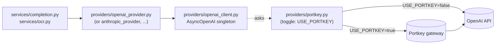

# Model providers

_Why model selection is built the way it is, and how to add a new model
or a whole new provider._

Users pick a model in the extension; the backend serves the request with
that model. The design goal: **adding a model — or an entire non-OpenAI
provider — should be a data change plus one new file, with no edits to
the route handler, the request schema, or the UI logic.** Today we ship
OpenAI models only, but the seams are in place.

## The two halves

```
            shared/src/models.ts            backend/.../providers/
          ┌──────────────────────┐         ┌──────────────────────────┐
          │ MODEL_CATALOG        │         │ CompletionProvider       │  (Protocol)
          │  • id                │         │  • openai_provider.py    │  (impl)
          │  • label             │         │  • registry.py           │  (dispatch)
          │  • provider ─────────┼───┐     └──────────┬───────────────┘
          │  • description       │   │                │
          │  • tier              │   │  provider_for_model(id)
          └──────────┬───────────┘   │     resolves a provider
                     │               └────────────────┘
        extension picker + request   backend dispatch
        validation (z.enum(MODEL_IDS))
```

### 1. The catalog (`@inkwell/shared`)

[`models.ts`](../../frontend/packages/shared/src/models.ts) is the single source
of truth for the extension. Every model is one `ModelInfo` entry in
`MODEL_CATALOG`:

```ts
{
  id: "gpt-4o-mini",          // sent in requests, stored in settings
  label: "GPT-4o mini",       // shown in the picker
  provider: "openai",         // which upstream serves it
  description: "...",         // blurb under the label
  tier: "fast",               // fast | balanced | quality
}
```

Derived from it:

- `ModelId` — the union of valid ids.
- `MODEL_IDS` — a tuple fed straight into `z.enum(...)`, so the request
  schema and the catalog can never drift.
- `DEFAULT_MODEL_ID` — the first catalog entry.
- `getModelInfo(id)` / `isModelId(id)` / `providerForModel(id)`.

The Python backend keeps a mirror of the catalog in
[`domain/models.py`](../../backend/src/inkwell_backend/domain/models.py)
with identical shape. Keep both copies aligned when you add a model.

### 2. The provider registry (backend)

A [`CompletionProvider`](../../backend/src/inkwell_backend/providers/base.py)
is one upstream:

```python
class CompletionProvider(Protocol):
    id: ModelProvider

    @property
    def configured(self) -> bool: ...   # real credentials present?

    def stream_completion(self, args: ProviderCompletionArgs) -> AsyncIterator[CompletionChunk]: ...
    async def recognize_text(self, args: VisionArgs) -> VisionResult: ...
    async def aclose(self) -> None: ...  # release pooled HTTP clients on shutdown
```

`recognize_text` covers `/api/v1/ocr`; the same provider serves both
chat completions and image-to-text so swapping vendors is one file.
`aclose` is called from the FastAPI lifespan hook via the registry —
each provider closes its own pools.

[`providers/registry.py`](../../backend/src/inkwell_backend/providers/registry.py)
holds a `dict[ModelProvider, CompletionProvider]`. The completion
pipeline calls `get_provider_for_model(model_id)` and streams from
whatever it gets back — it never names a concrete provider.

The registry is typed `dict[ModelProvider, CompletionProvider]`, so
widening the `ModelProvider` enum (step 1 below) produces a **type
error** until you register the matching provider. You can't ship a
model whose provider doesn't exist.

## How a request flows

1. Extension popover: the user picks a model from the catalog-driven
   `<select>` (defaulting to their saved `defaultModel`).
2. The chosen `model` rides in the `COMPLETE_START` message → the
   background attaches it to the `POST /api/v1/complete` body.
3. The backend validates `model` against the catalog — unknown ids
   are rejected as `VALIDATION_FAILED`.
4. `services/completion.py` resolves `get_provider_for_model(model)` and
   streams from it.

## Recipe: add another OpenAI model

Pure data change — one entry in `MODEL_CATALOG` on each side.

In `frontend/packages/shared/src/models.ts`:

```ts
{
  id: "gpt-4o",
  label: "GPT-4o",
  provider: "openai",
  description: "Higher quality, a little slower.",
  tier: "quality",
}
```

In `backend/src/inkwell_backend/domain/models.py`:

```python
ModelInfo(
    id="gpt-4o",
    label="GPT-4o",
    provider=ModelProvider.OPENAI,
    description="Higher quality, a little slower.",
    tier="quality",
),
```

The picker, the request schema, and validation all update automatically.

## Recipe: add a new provider (e.g. Anthropic)

1. **Widen the `ModelProvider` enum** on both sides:
   - `frontend/packages/shared/src/models.ts`:
     ```ts
     export type ModelProvider = "openai" | "anthropic";
     ```
   - `backend/src/inkwell_backend/domain/models.py`:
     ```python
     class ModelProvider(StrEnum):
         OPENAI = "openai"
         ANTHROPIC = "anthropic"
     ```
   The backend registry now fails to type-check — good, it's reminding
   you.

2. **Add the models** to `MODEL_CATALOG` on both sides with the new
   provider.

3. **Implement the provider** —
   `backend/src/inkwell_backend/providers/anthropic_provider.py`
   exposing a module-level `anthropic_provider: CompletionProvider`
   (mirror `openai_provider.py`: a real async stream + a non-configured
   fallback delegating to `mock_provider.mock_stream`).

4. **Register it** in `providers/registry.py`:
   ```python
   _PROVIDERS: dict[ModelProvider, CompletionProvider] = {
       ModelProvider.OPENAI: openai_provider,
       ModelProvider.ANTHROPIC: anthropic_provider,
   }
   ```
   Type error resolved.

5. Add any new credential to `settings.py` and `.env.example`.

Nothing else changes — not the route handler, not `services/completion.py`,
not the schema, not the extension UI.

## Portkey AI gateway (optional transport toggle)

The provider abstraction handles vendor *selection*. Portkey is a
**transport** layer that sits between the provider and the network —
toggled with `USE_PORTKEY=true` on the backend. The gateway adds
observability, caching, retries, fallbacks, and vault-backed secret
management without changing the application code.

The integration is deliberately concentrated in **one file**:
[`backend/src/inkwell_backend/providers/portkey.py`](../../backend/src/inkwell_backend/providers/portkey.py).
Provider implementations call its helpers; nothing else in the codebase
knows the gateway exists.



Two functions in `portkey.py` do all the work:

- `build_client_overrides(provider, vendor_api_key)` — returns the
  `base_url`, the `x-portkey-*` headers, and the api key to hand the
  vendor SDK. Returns `None` when the toggle is off, so the OpenAI
  client factory falls through to its default construction.
- `build_request_headers(trace_id)` — returns per-call `extra_headers`
  to merge on each SDK call. Today that's only
  `x-portkey-trace-id`, forwarded from `X-Client-Request-Id` so
  gateway-side logs join our audit log line on a single id.

### Adding the gateway to a new vendor

When you wire up Anthropic (or any other provider), call the same two
helpers from its client factory:

```python
# providers/anthropic_client.py (sketch)
from .portkey import build_client_overrides, build_request_headers

def get_anthropic_client():
    settings = get_settings()
    overrides = build_client_overrides(
        "anthropic",
        vendor_api_key=settings.anthropic_api_key,
    )
    if overrides is None:
        return AsyncAnthropic(api_key=settings.anthropic_api_key, ...)
    return AsyncAnthropic(
        api_key=overrides.api_key,
        base_url=overrides.base_url,
        default_headers=overrides.default_headers,
        ...
    )
```

The new vendor inherits the toggle, the trace forwarding, and the
audit log dimension for free.

### What ends up in the audit log

[`CompletionLogEvent.via_portkey`](../../backend/src/inkwell_backend/services/audit.py)
captures whether the gateway was on the call path:

| `has_openai` | `portkey_enabled` | `via_portkey` in log |
| --- | --- | --- |
| `false` (mock) | any | `null` — dimension would be misleading |
| `true` | `false` | `false` — direct vendor call |
| `true` | `true` | `true` — through the gateway |

Lets operators slice latency and error metrics by transport path.

## See also

- [Reference: API § /api/v1/complete](../reference/api.md#post-apiv1complete)
- [Reference: Architecture](../reference/architecture.md)
- [How-to: Add a site adapter](../how-to/add-a-site-adapter.md) — the same
  registry pattern, applied to context extraction.
- [Multilingual support](./multilingual-support.md) — the language
  catalog mirrors this same single-source-of-truth pattern.
