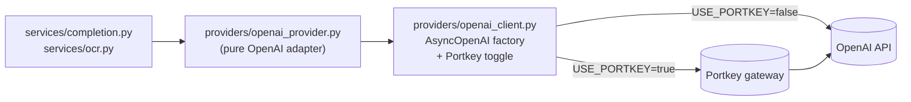

# Model providers

_Why model selection is built the way it is, and how to add a new model
or a whole new provider._

Users pick a model in the extension; the backend serves the request with
that model. The design goal: **adding a model — or an entire non-OpenAI
provider — should be a data change plus one new file, with no edits to
the route handler, the request schema, or the UI logic.** Today we ship
OpenAI models only, but the seams are in place.

## The two halves

```
   backend/.../config/models.catalog.json       backend/.../providers/
  ┌────────────────────────────────────────┐   ┌───────────────────────────┐
  │ {                                      │   │ CompletionProvider        │  (Protocol)
  │   "default": "gpt-4o-mini",            │   │  • openai_provider.py     │  (real impl)
  │   "models": [{                         │   │  • mock_provider.py       │  (fallback)
  │     "id": "gpt-4o-mini",               │   │  • registry.py            │  (dispatch)
  │     "label": "GPT-4o mini",            │   └──────────┬────────────────┘
  │     "provider": "openai",              │              │
  │     "description": "...",              │   provider_for_model(id) → enum
  │     "tier": "fast"                     │   registry then picks real-vs-mock
  │   }, ...]                              │              │
  │ }                                      │              ▼
  └────────────┬───────────────────────────┘   service code never names a
               │                                concrete provider — it
   • Backend reads at startup                   depends on the Protocol only
   • Extension fetches GET /api/v1/models       (Dependency Inversion).
     at runtime
   • Build step bakes the same JSON into
     the extension's bundled fallback
```

### 1. The catalog — one JSON file, both sides

The catalog lives in **one** git-tracked location:
[`backend/src/inkwell_backend/config/models.catalog.json`](../../backend/src/inkwell_backend/config/models.catalog.json).

Each entry has the same five fields:

```jsonc
{
  "id": "gpt-4o-mini",          // sent in requests, stored in settings
  "label": "GPT-4o mini",       // shown in the picker
  "provider": "openai",         // which upstream serves it
  "description": "...",         // blurb under the label
  "tier": "fast"                // fast | balanced | quality
}
```

How each side consumes it:

- **Backend** — [`domain/models.py`](../../backend/src/inkwell_backend/domain/models.py)
  reads the JSON at startup via `importlib.resources`, validates each row
  with Pydantic, and exposes `MODEL_CATALOG`, `DEFAULT_MODEL_ID`,
  `MODEL_IDS`, and `provider_for_model(id)`. Invariants enforced at load:
  shape, length caps, `default` ∈ `models`, non-empty list, and every
  `provider` field resolves to a registered `ModelProvider` enum value.
- **Extension** — at runtime, the background worker fetches
  `GET /api/v1/models` and caches the response in `chrome.storage.local`
  ([`extension/src/lib/models.ts`](../../frontend/packages/extension/src/lib/models.ts)).
  As a build-time fallback, the same JSON is copied into the shared
  package's source tree by
  [`scripts/sync-config.mjs`](../../frontend/packages/shared/scripts/sync-config.mjs)
  (runs as `pretypecheck` / `prebuild`). The wire-side schema lives in
  [`shared/src/models.ts`](../../frontend/packages/shared/src/models.ts)
  as `ModelCatalogResponseSchema`.

A drift detector (`make check-config` / `pnpm check-config`) fails CI if
a checkout missed the copy step.

### 2. The provider registry (backend)

A [`CompletionProvider`](../../backend/src/inkwell_backend/providers/base.py)
is one upstream:

```python
class CompletionProvider(Protocol):
    @property
    def configured(self) -> bool: ...   # real credentials present?

    def stream_completion(self, args: ProviderCompletionArgs) -> AsyncIterator[CompletionChunk]: ...
    async def recognize_text(self, args: VisionArgs) -> VisionResult: ...
    def stream_recognize_text(self, args: VisionArgs) -> AsyncIterator[str]: ...
    async def aclose(self) -> None: ...  # release pooled HTTP clients on shutdown
```

`recognize_text` covers the one-shot JSON path of `/api/v1/ocr`;
`stream_recognize_text` yields text deltas for the SSE path (the side
panel opts in via `Accept: text/event-stream` so users see text appear
as the model emits it). The same provider serves both chat completions
and image-to-text — streaming and non-streaming — so swapping vendors
is one file. `aclose` is called from the FastAPI lifespan hook via the
registry; each provider closes its own pools.

Adding a new provider means implementing all four methods. The OpenAI
provider builds the streaming and non-streaming vision calls from the
same prompt shape (only `stream=True` and the iteration loop differ),
and the mock provider yields the placeholder in a few small chunks so
local dev exercises the same SSE wire format as production.

[`providers/registry.py`](../../backend/src/inkwell_backend/providers/registry.py)
holds `_REAL_PROVIDERS: dict[ModelProvider, CompletionProvider]`. The
completion pipeline calls `get_provider_for_model(model_id)` and streams
from whatever it gets back — it never names a concrete provider.

The registry is typed `dict[ModelProvider, CompletionProvider]`, so
widening the `ModelProvider` enum (step 1 below) produces a **type
error** until you register the matching provider. You can't ship a
model whose provider doesn't exist.

### 3. The mock fallback — registry's job, not the provider's

The registry consults `real.configured` and returns the
[`mock_provider`](../../backend/src/inkwell_backend/providers/mock_provider.py)
when the real upstream lacks credentials:

```python
def get_provider_for_model(model_id: str) -> CompletionProvider:
    real = _REAL_PROVIDERS[provider_for_model(model_id)]
    return real if real.configured else mock_provider
```

This keeps real providers free of fallback logic (Single Responsibility)
and means a future Anthropic provider gets the same mock behaviour for
free (Open/Closed — add a class; don't duplicate the fallback).

## How a request flows

1. Extension popover: the user picks a model from the live catalog
   (defaulting to their saved `defaultModel`).
2. The chosen `model` rides in the `COMPLETE_START` message → the
   background attaches it to the `POST /api/v1/complete` body.
3. The backend validates `model` against `MODEL_IDS` — unknown ids are
   rejected as `VALIDATION_FAILED`.
4. `services/completion.py` resolves `get_provider_for_model(model)` and
   streams from it.

## Recipe: add another OpenAI model

Pure data change — one entry in the JSON catalog.

In [`backend/src/inkwell_backend/config/models.catalog.json`](../../backend/src/inkwell_backend/config/models.catalog.json):

```jsonc
{
  "id": "gpt-4o",
  "label": "GPT-4o",
  "provider": "openai",
  "description": "Higher quality, a little slower.",
  "tier": "quality"
}
```

Restart the backend. The picker, the request schema, the validation,
and the extension's bundled fallback all update automatically — the
backend reads the JSON at startup and the extension's next
`/api/v1/models` fetch sees the new entry.

## Recipe: add a new provider (e.g. Anthropic)

1. **Widen the `ModelProvider` enum** in
   [`domain/models.py`](../../backend/src/inkwell_backend/domain/models.py):
   ```python
   class ModelProvider(StrEnum):
       OPENAI = "openai"
       ANTHROPIC = "anthropic"
   ```
   The backend registry now fails to type-check — good, it's reminding
   you.

2. **Add the models** to `models.catalog.json` with the new provider
   string. The JSON-side Pydantic validator gates the `provider` field
   against the enum, so a typo fails at startup.

3. **Implement the provider** —
   `backend/src/inkwell_backend/providers/anthropic_provider.py`
   exposing a module-level `anthropic_provider: CompletionProvider`.
   The class is **pure Anthropic**; it does not import the mock provider
   or handle any fallback. Just implement `configured`,
   `stream_completion`, `recognize_text`, `stream_recognize_text`, and
   `aclose`.

4. **Register it** in `providers/registry.py`:
   ```python
   _REAL_PROVIDERS: dict[ModelProvider, CompletionProvider] = {
       ModelProvider.OPENAI: openai_provider,
       ModelProvider.ANTHROPIC: anthropic_provider,
   }
   ```
   Type error resolved. The mock-fallback behaviour applies for free —
   the registry calls `real.configured` regardless of which vendor.

5. Add any new credential to `settings.py` and `.env.example`.

Nothing else changes — not the route handler, not `services/completion.py`,
not the schema, not the extension UI.

## Portkey AI gateway (optional transport toggle)

The provider abstraction handles vendor *selection*. Portkey is a
**transport** layer that sits between the provider and the network —
toggled with `USE_PORTKEY=true` on the backend. The gateway adds
observability, caching, retries, fallbacks, and vault-backed secret
management without changing the application code.

The integration is deliberately concentrated in **one file**:
[`backend/src/inkwell_backend/providers/openai_client.py`](../../backend/src/inkwell_backend/providers/openai_client.py).
It is the single configuration point for the OpenAI SDK — direct *or*
via Portkey — and the only place in the backend that knows the
gateway exists.



Two modes, one SDK call. Schematically:

```python
# USE_PORTKEY=false → direct OpenAI
AsyncOpenAI(api_key=OPENAI_API_KEY, timeout=...)

# USE_PORTKEY=true → Portkey gateway
AsyncOpenAI(
    api_key=<placeholder or vendor key>,
    base_url=PORTKEY_BASE_URL,
    default_headers=createHeaders(
        api_key=PORTKEY_API_KEY,
        provider="openai",
        virtual_key=PORTKEY_VIRTUAL_KEY,  # optional
        config=PORTKEY_CONFIG,             # optional
    ),
    timeout=...,
)
```

The public surface of `openai_client.py` is two functions:

- `get_openai_client()` — returns the process-wide `AsyncOpenAI`
  singleton, mode-agnostic. Callers in `openai_provider.py` don't
  branch on the toggle.
- `build_request_headers(trace_id)` — returns per-call `extra_headers`
  to merge on each SDK call. Today that's only
  `x-portkey-trace-id`, forwarded from `X-Client-Request-Id` so
  gateway-side logs join our audit log line on a single id. Returns
  `None` when Portkey is off or no trace id is available — a no-op
  for the SDK.

### Adding the gateway to a new vendor

The Portkey integration above is tied to the OpenAI SDK because the
gateway is OpenAI-SDK-compatible by design. When you wire up a vendor
whose SDK is not OpenAI-shaped (e.g. native Anthropic), apply the same
transport pattern in that vendor's own client factory:

```python
# providers/anthropic_client.py (sketch)
def get_anthropic_client():
    settings = get_settings()
    if settings.portkey_enabled:
        return AsyncAnthropic(
            api_key=...,
            base_url=settings.portkey_base_url,
            default_headers=createHeaders(provider="anthropic", ...),
        )
    return AsyncAnthropic(api_key=settings.anthropic_api_key)
```

The toggle, the trace forwarding, and the audit log dimension carry
over identically.

### What ends up in the audit log

Both
[`CompletionLogEvent.via_portkey`](../../backend/src/inkwell_backend/services/audit.py)
and `OcrLogEvent.via_portkey` capture whether the gateway was on the
call path:

| `has_openai` | `portkey_enabled` | `via_portkey` in log |
| --- | --- | --- |
| `false` (mock) | any | `null` — dimension would be misleading |
| `true` | `false` | `false` — direct vendor call |
| `true` | `true` | `true` — through the gateway |

Lets operators slice latency and error metrics by transport path. The
matching startup log line `inkwell-backend ready: <transport>` reports
the active mode at a glance.

`OcrLogEvent` carries two extra dimensions absent from completion logs:
`cache_hit` (response served from the in-process result cache) and
`streamed` (SSE path vs JSON path). Cache hits are useful for
projecting upstream-cost savings; the streaming flag separates the
side-panel SSE path from the right-click-context-menu JSON path so
their latencies don't get blended in a single histogram.

## See also

- [Reference: API § /api/v1/complete](../reference/api.md#post-apiv1complete)
- [Reference: Architecture](../reference/architecture.md)
- [How-to: Add a site adapter](../how-to/add-a-site-adapter.md) — the same
  registry pattern, applied to context extraction.
- [Multilingual support](./multilingual-support.md) — the language
  catalog mirrors this same single-source-of-truth pattern.
